# TheGrue2 - HackOn CTF 2026

El pasado fin de semana del 21 de febrero, tuvo lugar por fin la competición CTF de la HackOn. Un evento que muchos de nosotros esperamos activamente cada año, ya que es un momento en el que se junta toda la comunidad española para pegarse por el podio. Este año tuve la oportunidad de crear retos en la categoría de **pwn** y en la categoría de **misc**. Los últimos años ha sido siempre un evento con mucha calidad y mucho nivel en los retos, sabíamos que iban a haber expectativas altas al respecto, así que quisimos ir un paso más allá e innovar un poco más con los retos.

Mientras yo seguía con los retos de **pwn**, Znati creó [TheGrue](https://znatii.github.io/posts/thegrue/), un reto de **GamePwn** en Unity 2D. Lo probé y me encantó, así que hablé con él para hacer una secuela que siguiese con la misma temática.
[TheGrue](https://znatii.github.io/posts/thegrue/) fue un reto que consistía en modificar el ID de un elemento del juego a la hora de realizar una transacción, para acceder a un objeto para el cual no teníamos acceso previamente, y así conseguir la flag. Este reto estaba ambientado en la Universidad Rey Juan Carlos, con referencias hacia compañeros, aulas, e incluso el típico Pacman de la entrada del Aulario I. Recomiendo ir al blog de **znatii**, para ver el writeup detallado.

Una vez empezamos a pensar el reto, se nos ocurrió esta vez hacerlo en 3D. Esto, a dos semanas de empezar el CTF, iba a ser bastante trabajo teniendo en cuenta nuestra experiencia desarrollando videojuegos (ninguna). Se me ocurrió avisar a [Dogenati](https://www.linkedin.com/in/oscar-freire-lojo/), que después de explicarle lo que es la HackOn, el CTF y la idea que teníamos, nos apoyó sin pensarlo. Él nos sugirió, dado el poco tiempo que teníamos, crear un juego con estilo **low poly** utilizando como texturas imágenes reales de los edificios y los personajes como se hacía antiguamente en muchos juegos de PS1.

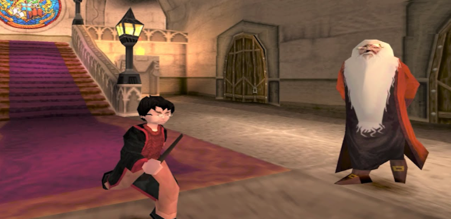

_Harry Potter en PS1 (ejemplo de low poly)_

## Primer prototipo

Aún no sabíamos cuál iba a ser la vulnerabilidad, cuál iba a ser el objetivo del juego, pero sabíamos que tenía que estar ambientado en el campus de Móstoles de la URJC así que a los pocos días Doge ya nos envió el primer prototipo para el mapa.

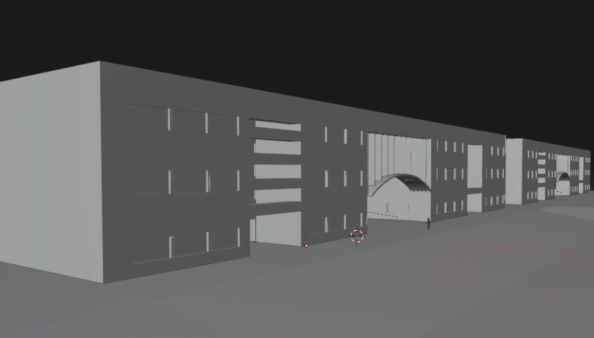

Mientras tanto, seguíamos jugando con Unity para sacar adelante un script de movimiento para el personaje.

Para todo el proceso, ha sido muy útil el trabajo de [Brackeys](https://www.youtube.com/@Brackeys), especialmente a la hora de crear los [diálogos](https://www.youtube.com/watch?v=_nRzoTzeyxU). 

## Primera fase de la explotación

En cuanto a la idea, finalmente optamos por hacer un reto cuya explotación tuviese **2 fases**. En otros CTF se ha visto muchas veces la dinámica de recoger monedas y modificar la puntuación, o atravesar paredes. Santi pudo asistir a la charla de [Alex Soler](https://www.linkedin.com/in/alexsoleralvarez/) en la hc0n 2026, donde se hablaba de reversing de juegos mediante el uso de r2frida. Allí se modificaba la gravedad del mundo para poder acceder a lugares que no estaban inicialmente preparados para ello. Nuestra primera vulnerabilidad se basó en este principio, sólo que nosotros no utilizamos r2frida, sino que lo creamos para hacerlo con Cheat Engine como en muchos otros retos de la categoría. Para ello, la idea sería crear una entrada en la azotea a lo que tendría que ser el Aulario, y pistas alrededor del mapa que dieran a entender que deben subir al tejado.

Para el momento en el que nosotros ya habíamos terminado de programar el diálogo y el sistema de NPCs, Doge nos pudo enviar el mapa final con las texturas. Nosotros previamente le habíamos enviado fotos reales de la Universidad para poder hacerlo lo más realista posible, el resultado, a nuestro parecer, fue perfecto. En cuanto nos quisimos dar cuenta teníamos un mapa funcional de la URJC que tanto habíamos visto.

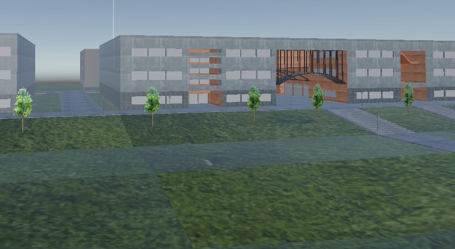

Ya con este mapa, nos pusimos manos a la obra con la funcionalidad importante para el propio reto. En la azotea del Aulario I, vemos una puerta que sería la que nos deja acceder al interior, pero cuando intentamos interactuar con ella para entrar aparece un diálogo que nos informa del porqué no podemos acceder aún.

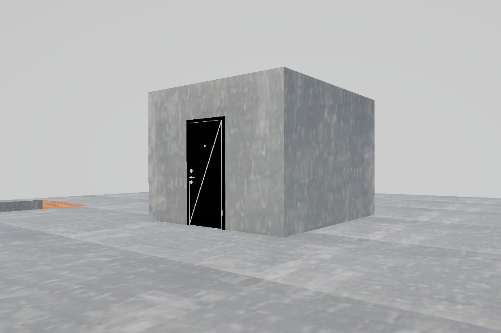
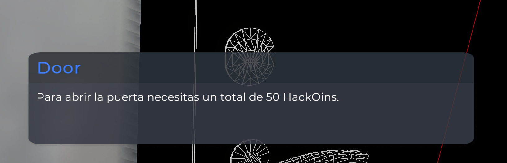

## Segunda y última fase de la explotación

Nos podemos imaginar cuál es la segunda parte del reto, conseguir la cantidad de monedas necesaria para poder abrir la puerta. Pero antes, tenemos que crear la escena en Unity con la flag, así como las propias monedas. Para las coins simplemente decidimos poner el logo de la HackOn con una animación simple hecha con la librería **DOTween** para dar un efecto 3D a una imagen 2D, de forma que la moneda siempre estuviese mirando hacia el personaje. Con esto, llenamos el mapa con aproximadamente 23 HackOins a lo largo de todo el campus. Siendo el total de monedas a recoger 50, el jugador tendría que parchear de alguna forma el juego para poder llegar al requerimiento.

Para ayudar al jugador, se distribuyeron distintos NPCs a lo largo del mapa. Éstos, tenían diálogos concretos que daban pistas sobre lo que había que hacer o hacia dónde había que dirigirse para avanzar en el reto.

## Flag y detalles

La escena para la flag fue la escena predeterminada de un interior en Unity, añadiendo paredes en un pasillo y aplicándole como textura la imagen que aparecía cuando te comía The Grue en el primer reto. Para obtener la flag había que hablar con **Deoxys**, haciendo un guiño a otro reto de la misma categoría durante el CTF. Además también se encontraba el NPC de **Dr3y**, igual que en TheGrue.

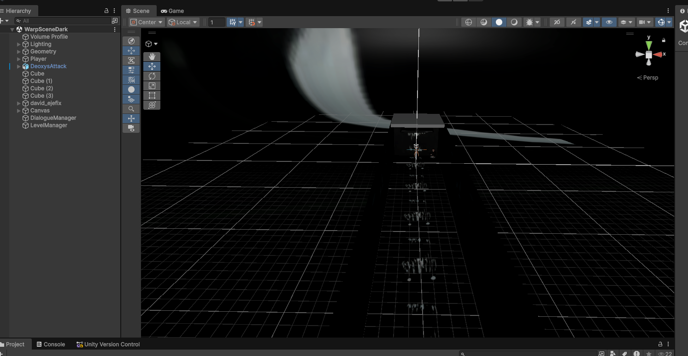

Con toda la funcionalidad creada, Doge nos brindó finalmente el modelo para los NPC. Con un total de 6 personajes creados con fotos nuestras, teníamos el juego terminado. Se añadieron los últimos detalles: referencias a la universidad, el logo de la HackOn, el logo de la asociación SeekNHack de la propia URJC, un menú principal... y por fin, teníamos un reto funcional completado y listo para subirse a la plataforma de la competición.

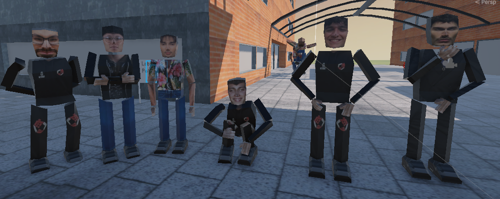

## Solución no intencionada y AntiCheat

Para la solución intencionada nuestra idea era que el jugador modificase la instrucción en memoria de la función `AddCoin`, para que a la hora de sumar las monedas en lugar de ejecutarse `score += 1`, se ejecutase `score += 50`. De esta forma se podría llegar al requerimiento de manera sencilla. Para esto, había que proteger de alguna forma la propia puntuación del jugador, para que no pudiese ser alterada. Se utilizó GUPS AntiCheat, que nos brinda un tipo de dato nuevo: `ProtectedInt32`, que será un entero que está encriptado en memoria para que su modificación no sea posible.

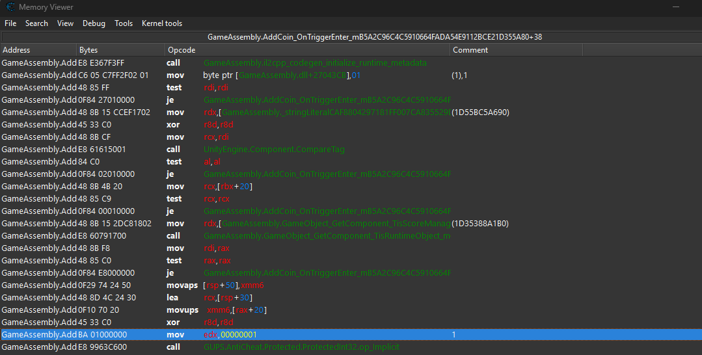

Si la instrucción `mov edx,00000001` la modificamos por `mov edx,00000020`, cada vez que obtengamos una moneda, nuestra puntuación aumentará 32 puntos más (20 en hexadecimal). Rápidamente vemos nuestro score aumentar de esta forma.

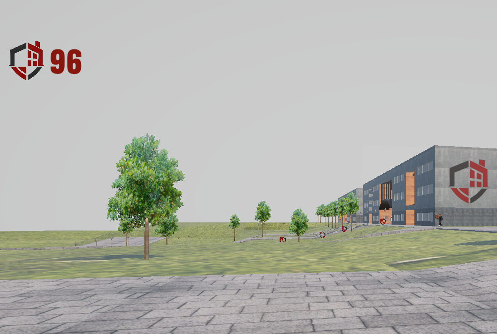

Por supuesto, al estar la propia flag dentro de un diálogo, me preocupé en que se mantuviese encriptada. Por suerte, GUPS AntiCheat tiene el tipo de dato `ProtectedString` que nos permitiría mantener la flag oculta en memoria. El problema viene cuando los diálogos se modifican (por comodidad) desde el Inspector de Unity (la pestaña de la derecha).

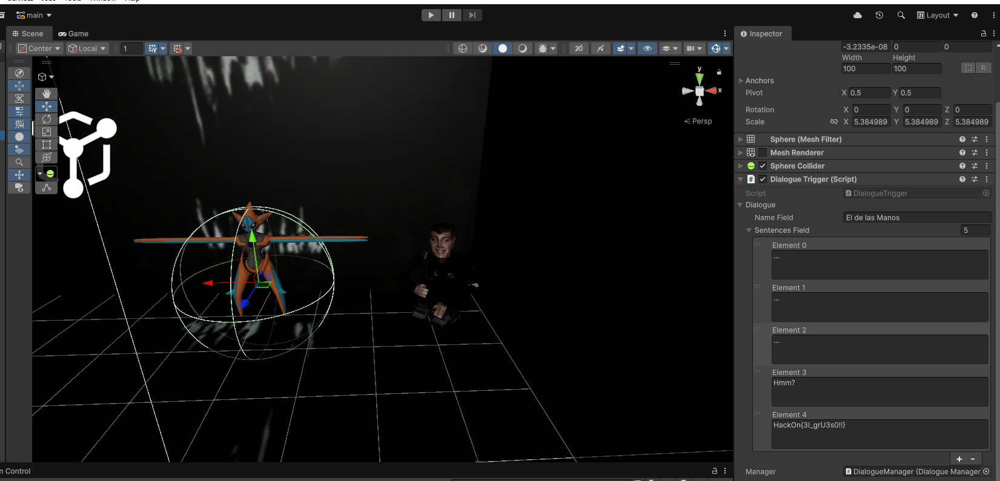

Cuando el tipo de dato no es `String`, Unity no deja modificarlos desde el Inspector. Yo quería seguir haciéndolo de esta forma, así que se (vibe)implementó un sistema que convertiría la cadena a `ProtectedString`, de esta forma podíamos modificarlo desde el Inspector pero a la hora de guardarse en memoria estaría seguro. O eso pensé yo, la realidad es que aunque se convierta, ha estado como tipo `string` en algún momento, y eso no iba a desaparecer de la memoria del programa. Por lo tanto, una solución que había para este reto (aunque por suerte no mucha gente lo encontró), era dumpear todas las strings del juego `strings -a TheGrue2/*`. La flag aparecía en el archivo `level2` (la escena final).

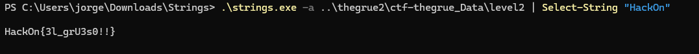

Pese a todo, yo personalmente quedé muy satisfecho y muy contento con el trabajo que habíamos hecho y con todo lo que he aprendido gracias a esta oportunidad.

## Autores
- Dogenati (Óscar Freire): https://www.linkedin.com/in/oscar-freire-lojo/
- Znati (Santiago Tovar): https://www.linkedin.com/in/santiago-tovar-velasco/
- lkt (Jorge Moreno): https://www.linkedin.com/in/mcjorgee0/

Archivos del reto: [thegrue2.zip](assets/thegrue2.zip)

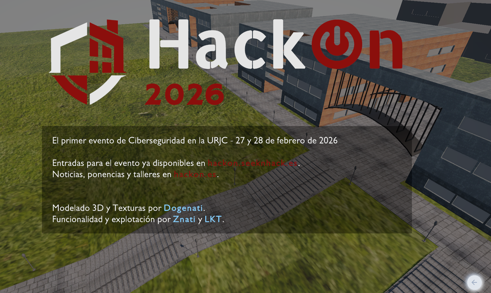