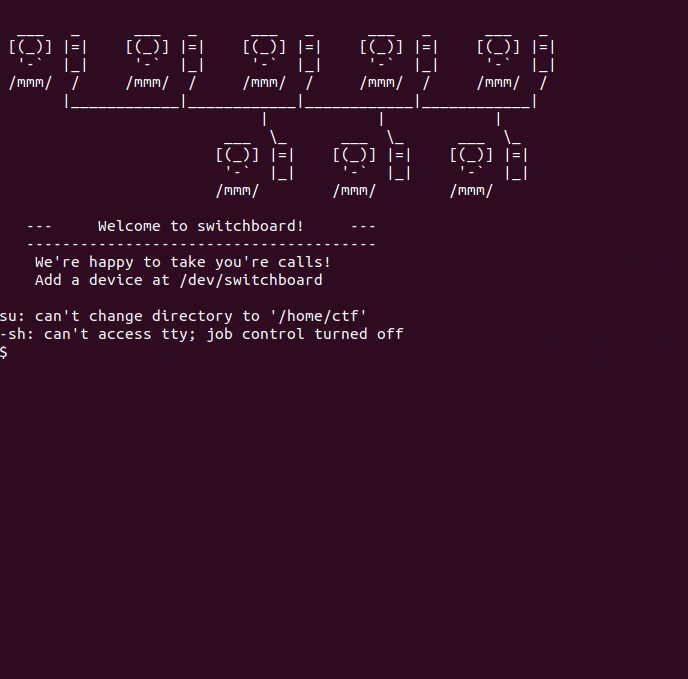

# Switchboard

## TL;DR
- kUAF and double-free in ``kmalloc-cg-32`` without ``CONFIG_SLAB_FREELIST_HARDENED``

## Challenge Description

> Your standard SLAB notetaking app!

- Category: **pwn**

## Exploitation
### Analyzing the source code

- For this challenge we are provided with the source code [switchboard.c](assets/switchboard.c) that implements a switchboard kernel module, with different device management operations. It uses the `switch_device` struct:

```c
struct switch_device {
    char *buf;
    void *head, *tail, *seek;
    int len;
    uint8_t inuse;
    uint8_t freed;
    unsigned long t_settings;
};
```

- Device operations:
    * ``obj_new``: Creates a new switch_device object, allocates a 32-byte buffer, initializes all pointers to the buffer start, sets ``inuse=1``, and adds it to the global list.
    * ``obj_select``: Selects a device by index from the device list.
    * ``rx_handle``: `copy_from_user` handler. If the device ``inuse==0``, it allocates a new 32-byte buffer first.
    * ``tx_handle``: `copy_to_user` handler. Uses `dev->t_settings` for retransmission.
    * ``buf_reset``: Sets seek=head and marks device as not in use (inuse=0). If already not in use, frees the buffer memory.
    * ``n_set``: Sets the maximum data length for the selected device's buffer, stored in ``dev->len``.
    * ``settings``: Configures transmission settings for the selected device. The t_settings field uses bit 0 to control retransmission behavior in tx_handle.

- There are two major issues in the module, after freeing a specific node reseting its buffer with `buf_reset`, the pointer is not cleared, leading to a use-after-free vulnerability. This is critical considering that there are no modern protections such as `CONFIG_SLAB_FREELIST_HARDENED`, that prevent the tampering of slab freelists. The other problem is at `buf_reset`, where after freeing a node we set ``dev->freed = 1``, but there are no checks that use this field so we can infinitely free a chunk.

```c

static long buf_reset(unsigned long arg){
    struct switch_device *dev = get(selected);
    if(!dev)
        return -1;
    if(dev->inuse == 0){ // <- There are no checks to see if it is already freed
        kfree(dev->buf);
        dev->freed = 1; // Set freed to 1
        return 1;
    }
    dev->seek = dev->head;
    dev->inuse = 0;
    return 0;
}

```

### Exploiting the vulnerability

- With this information we know that we can achieve a write-what-where primitive in the kernel, but to achieve root in the VM we need to leak kernel base address. To do this we are going to take advantage of `seq_operations` object.
- We know that the allocation that is happening in the module is of size `BUF_SIZE`: `dev->buf = kzalloc(BUF_SIZE, GFP_KERNEL_ACCOUNT)`, so we know the object ends getting placed in a ``kmalloc-cg-32`` slab. In the linux kernel, caches are shared across the system, so we can abuse this fact by allocating an object that we know that contains kernel pointers and read them using our kUAF to leak kernel addresses. 
- The `seq_operations` object is placed inside kmalloc-cg-32 when opening the file `/proc/self/stat` and it is freed when closed. This object is often used to achieve RIP control by overwriting one of its pointers with an arbitrary address, but in our case we will only leak kernel base using the first pointer in the structure. More info [here](https://ptr-yudai.hatenablog.com/entry/2020/03/16/165628#seq_operations).

```c
struct seq_operations {
	void * (*start) (struct seq_file *m, loff_t *pos); // <- We will read this one and calculate the offset to kernel base
	void (*stop) (struct seq_file *m, void *v);
	void * (*next) (struct seq_file *m, void *v, loff_t *pos);
	int (*show) (struct seq_file *m, void *v);
};
```

- Knowing this we can follow the next approach to leak kernel pointers:
    * 1. Double free a device object
    * 2. Allocate a device (we do this first because it is using ``kzalloc`` to zero out previous content)
    * 3. Because it is freed again, we can place `seq_operations` inside by calling ``open("/proc/self/stat")``
    * 4. Read from the device to get leaks

### Getting the flag



### Solvers

You can find the solver [here](assets/main.c).